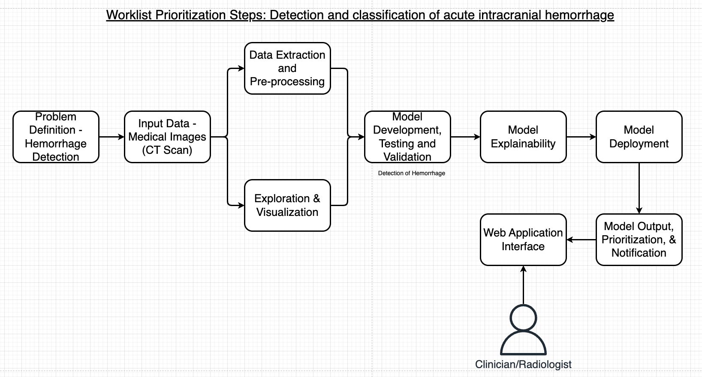
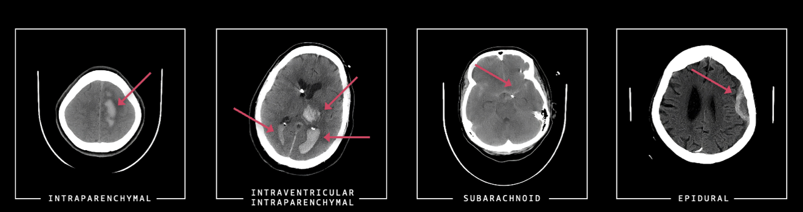
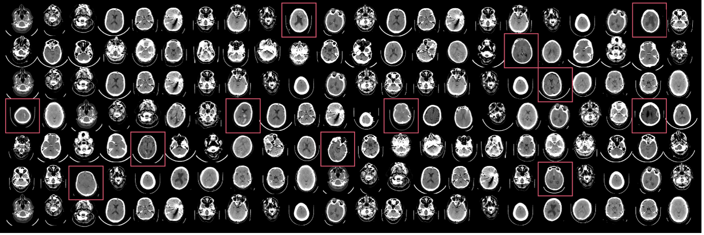
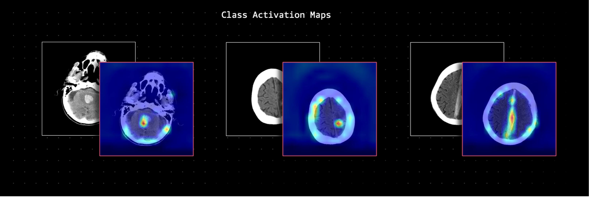

# Explainable Intracranial Hemorrhage Detection for Radiologist Workflow Prioritization

Intracranial hemorrhage, a severe medical condition occurring within the cranium, necessitates rapid and intensive medical intervention. This condition contributes significantly to stroke cases, which rank as the fifth-leading cause of death in the United States. Timely and accurate identification of the hemorrhage's location and type is paramount for effective patient treatment. To address this urgent medical need, we explore the impact of integrating AI and machine learning in radiology workflows. By using computer vision models and explainable AI to reprioritize worklists, we aim to enhance the efficiency and effectiveness of diagnosing intracranial hemorrhage. This process promises to streamline patient care, reduce the time to diagnosis, and ultimately improve patient outcomes in clinical settings.

## Data Collection and Loading
The ICH data was collected from the [RSNA Intracranial Hemorrhage Detection](https://www.kaggle.com/competitions/rsna-intracranial-hemorrhage-detection/data) challenge which was designed to identify acute intracranial hemorrhage. Intracranial hemorrhage is a serious condition caused by various factors, including trauma and high blood pressure, leading to symptoms that can range from headaches to life-threatening complications. Radiologists are key in detecting and assessing the hemorrhage to guide potential emergency surgical decisions. For this work, we used labeled data for both hemorrhage and non-hemorrhage examples.

## Data Pre-processing

To start we pre-processed the labels into two classes - `normal` (no-hemorrhage) and `hemorrhage`. This enables us to create a solution with a binary class instead of the multi-class / multi-label approach with different types of ICH. The CT images have a large dynamic range (12-16 bits) that cannot be fully displayed on a monitor. To highlight different intensity ranges, radiologists apply multiple window settings like brain (level 40/width 80), subdural (level 80/width 200), and bone (level 600/width 2800) windows when reviewing scans. These settings make abnormalities more conspicuous. To mimic this workflow, we preprocess each image by applying the three window settings and converting the results to 8-bit grayscale images. The three grayscale images are assembled as the RGB channels of an image and used as input to the 2D CNN classifier.

## Model Development 
The code trains a deep learning model on an intracranial hemorrhage dataset. It attaches a classification layer to a feature extractor model from TensorFlow/PyTorch hub and initializes the layer parameters randomly. The classification layer output matches the number of classes. Fine-tuning minimizes classification error on the input data for deployment. The training data must be formatted into subdirectories per class with .jpg images. The code saves the trained model and a label mapping file to an S3 bucket. It allows setting training job parameters like data path, output path, and instance type. It also sets algorithm hyperparameters. After training, the code can deploy the model for inference.

## Explainable Computer Vision with Class Activation Maps
Grad-CAM (Gradient-weighted Class Activation Mapping) is a technique that produces visual explanations for decisions from convolutional neural networks. It uses the gradients flowing into the last convolutional layer to produce a heat map highlighting important regions in the image for predicting the outcome. A key advantage of Grad-CAM is that it can be applied to any CNN-based model after training, without needing to modify the architecture. It computes the gradient of the target class score with respect to the feature maps of the last convolutional layer. These gradients are pooled globally to obtain importance weights, which are used to take a weighted combination of the feature maps to highlight the relevant regions. This provides an intuitive visualization of where the model is focusing to make decisions. We implemented the Grad-CAM using this [library](https://github.com/jacobgil/pytorch-grad-cam).
 

## Authors and acknowledgment
Special thanks to Ekta Walia Bhullar, Priya Padate, and Wale Akinfaderin for their contributions to this project and sharing their expertise in this field.

## License
This library is licensed under the MIT-0 License. See the LICENSE file.
